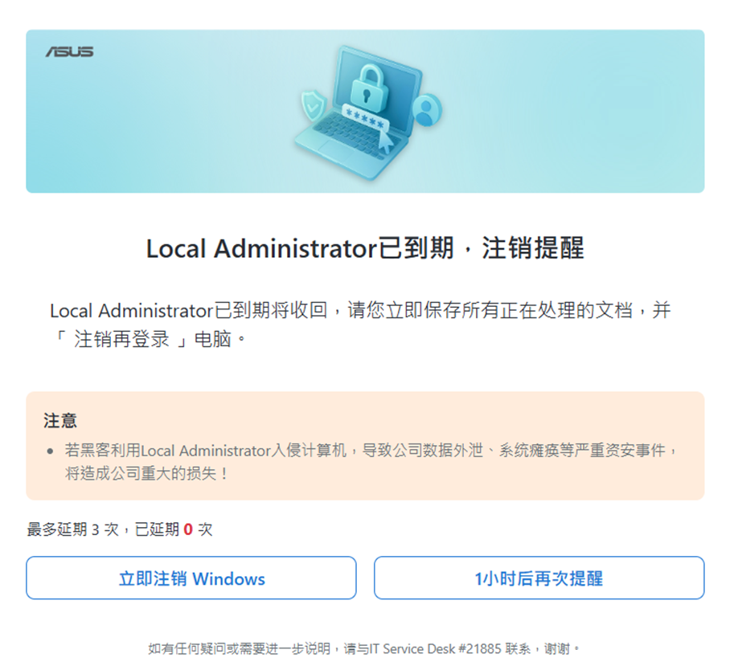
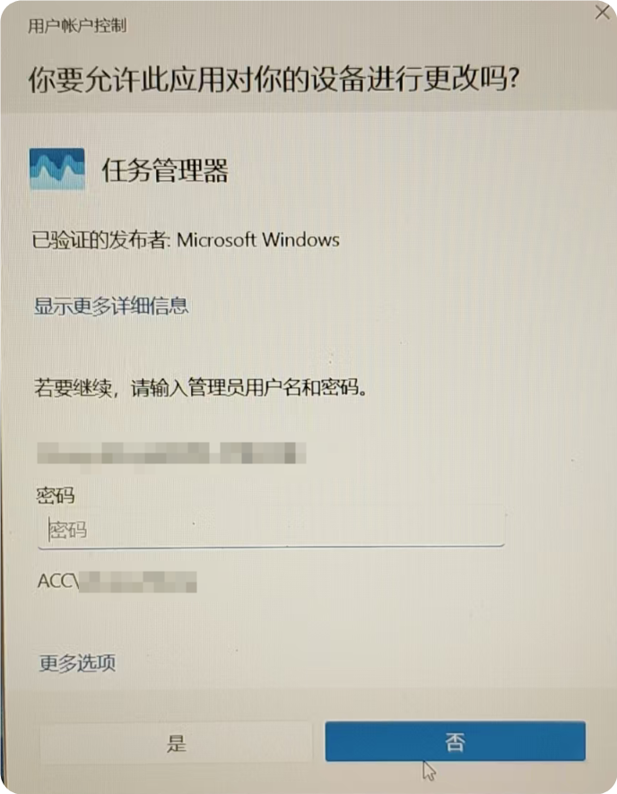

### **Local Administrator（本地管理员权限）**  

**策略描述**:  
根据企业IT安全策略，系统账户默认7天进行注销登录。  

以及任何需要修改系统核心设置、安装或删除程序、更改关键系统文件的动作都可能触发本策略。  

**操作流程**:  
1. **系统账户注销**：根据用机情况，选择立即注销Windows或1小时后再次提醒（默认次数为3次）。  
2. **其他涉及管理员权限操作**：在弹出的“用户账户控制”窗口，输入管理员密码，点“是”。  
* 如果弹出如下提示窗口，说明机器处于未连接公司内网环境状态，需连接VPN再进行下一步申请操作。  
  
  

* 如果弹出如下提示窗口，请选择Local Administrator申请时效（一次性或长周期）并点击“确认申请”。  
* 
    

2.1 **申请完成注销账户**：申请Local Administrator设定完成后，根据用机情况选择“立即注销Windows、取消申请或1小时后再次提醒”。  

