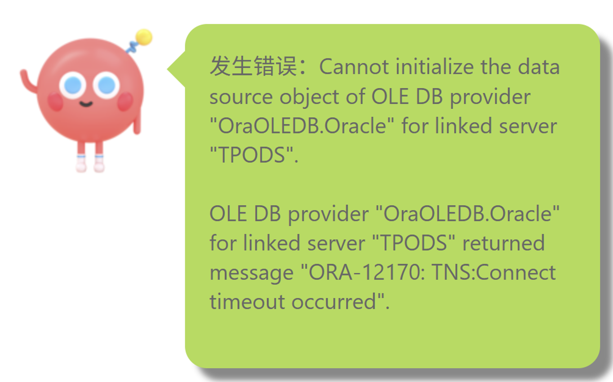
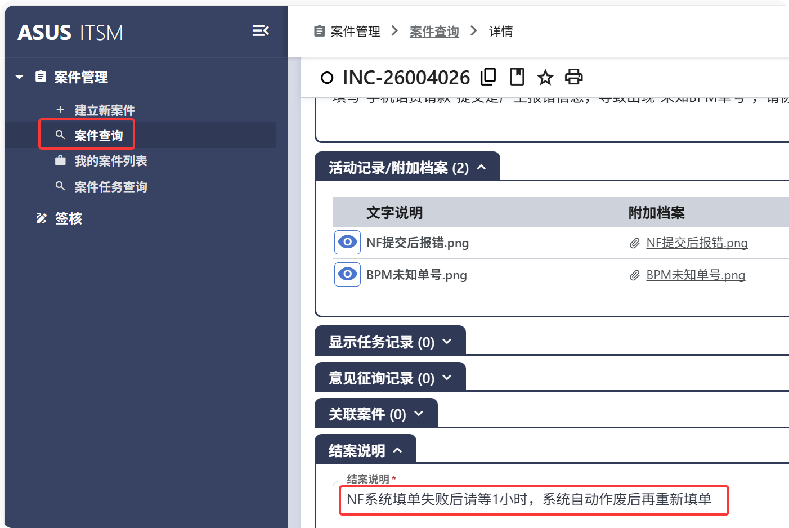

### **NF请款单提交后报错**  

**问题描述**:  
NF请款单提交后报错，此时从NF请款系统查询提交的表单，名称为“未知BPM单号”，状态为空。  

**解决方案**:  
1.**定位到ITSM报修系统**: 可直接通过链接地址或从ACC首页导航进入。  
  ITSM系统链接：https://itsm.asus.com/  
  

2.**填写表单并提交**: 建立案件。根据报修故障，在案件资讯区域选择服务分类，在案件描述区域填写故障描述（可以附截图说明）。确认无误后提交表单（Outlook邮箱会收到表单通知，可查询跟踪案件进度）。  

3.**后续查询**：在ITSM系统可根据案件查询来主动关注表达处理进度。  

