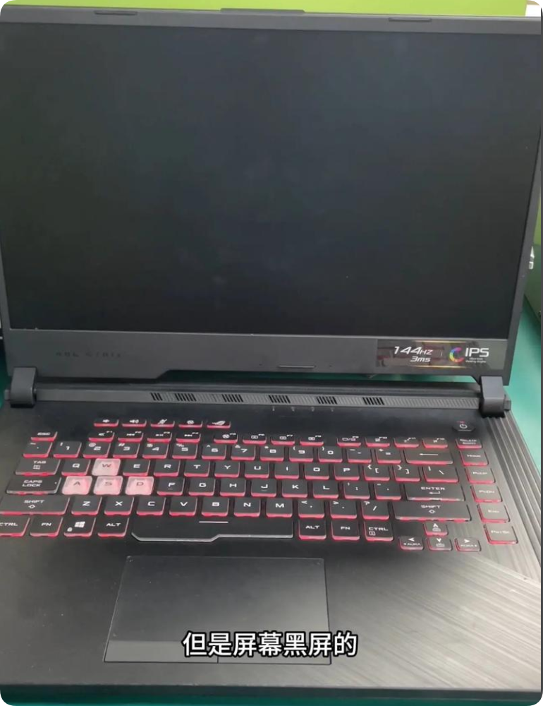

# 华硕笔记本电脑开机无显示问题诊断：

<!--{width="30%"}-->
github在线更新内容18:56

### 1. **基础检查**
-   **电源与指示灯**：确认电源适配器已牢固连接，且充电指示灯亮起。尝试移除电池，仅使用适配器开机。
-   **外部显示测试**：使用HDMI或VGA接口连接外接显示器。若外接显示器有显示，则可能为笔记本屏幕、屏线或相关组件故障。

### 2. **硬件重置与内存检查**
-   **释放静电**：关机并断开所有外设、电源及电池（若可拆卸）。长按电源键20-30秒以释放残余电荷，然后重新连接电源尝试开机。
-   **重新插拔内存**：关机断电后，打开后盖，取下内存条，用橡皮擦清洁金手指，然后重新牢固安装。尝试使用单根内存或更换插槽测试。

### 3. **显示相关诊断**
-   **观察背光与内容**：在黑暗环境下开机，仔细观察屏幕。若隐约可见图像（有内容无背光），则可能是背光系统（如屏线、LED）故障。
-   **监听启动音**：注意开机时是否有进入操作系统的提示音或硬盘读写声。若有，则主机可能已正常启动，问题集中于显示部分。

### 4. **BIOS/硬件故障诊断**
-   **CMOS重置**：关机断电后，找到主板上纽扣电池（CR2032），将其取下并短接电池座正负极触点约1分钟，或使用主板上的“CLRTC”跳线进行复位（请参考手册）。
-   **最小系统测试**：在断电状态下，仅连接电源、单根内存和CPU（移除硬盘、无线网卡等非必要部件）开机。若问题依旧，则为主板、CPU或内存问题。

### 5. **专业维修建议**
-   **送修**：若以上步骤均无效，可能涉及主板（如显卡芯片、桥芯片）、CPU或屏幕硬件故障。建议联系平台MIS，将设备送到客服中心进行检测。

---
**注意事项**：操作前请确保已断开所有电源。建议优先寻求平台MIS帮助，以避免扩大故障。
